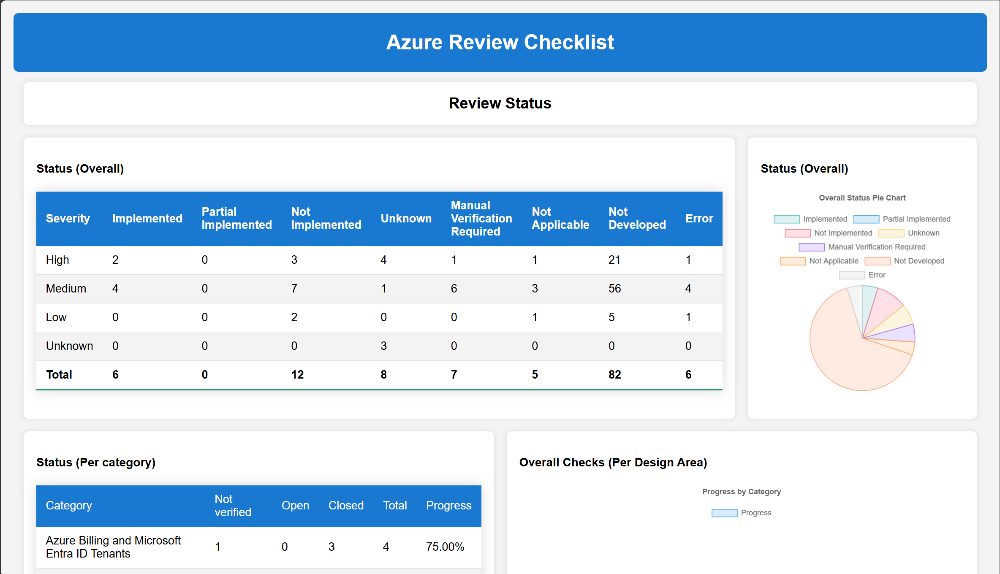
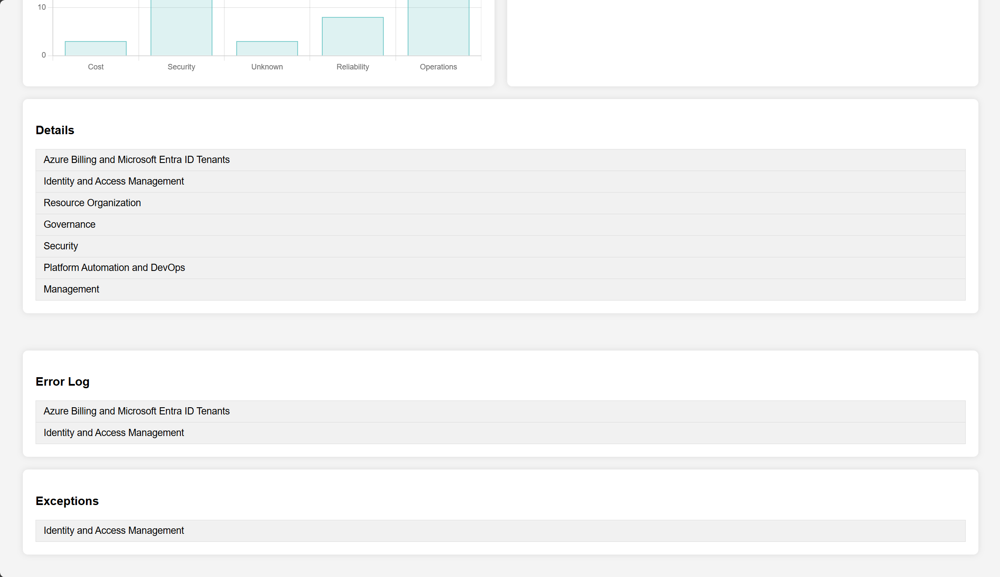

# Azure Landing Zone Assessment Automation

## 🎯 Project Overview

This project provides **automated evaluation and assessment** of Azure Landing Zone implementations based on the official **Azure Landing Zone Framework**. It delivers comprehensive analysis across all design areas with intelligent automation, modern PowerShell architecture, and interactive visualization.

### 🚀 Key Features

- **🔍 Comprehensive Assessment**: Evaluates 8 core design areas of Azure Landing Zone
- **⚡ Modern Architecture**: Optimized PowerShell codebase with shared context, caching, and standardized error handling
- **📊 Interactive Dashboard**: Beautiful web-based visualization with charts, tables, and detailed insights
- **🎛️ Flexible Configuration**: Tenant-scoped evaluation with configurable design areas
- **🔧 Exception Handling**: Manual override capabilities for specific organizational requirements
- **📋 Detailed Reporting**: JSON reports, error logs, and execution transcripts
- **🛡️ Secure by Design**: Tenant-scoped authentication with proper context isolation

### 📈 What You Get

1. **Structured JSON Report** (`reports/report.json`) with detailed findings
2. **Interactive Web Dashboard** (`web/index.html`) with charts and tables
3. **Comprehensive Error Logging** with troubleshooting information
4. **Execution Transcripts** for audit and debugging purposes
5. **Exception Management** for customized assessments

---

## 📁 Project Structure

```
LandingZoneAssessment-Automate/
├── 📁 bicep/               # Infrastructure as Code (Bicep)
├── 📁 arm/                 # ARM templates for Azure resources
├── 📁 scripts/             # 🔧 Main execution scripts
│   ├── Main.ps1           # Primary assessment execution
│   ├── Initialize.ps1     # Environment setup and authentication
│   └── CreateWebSite.ps1  # Dashboard generation
├── 📁 functions/           # 🧩 Assessment modules (modernized architecture)
│   ├── AzureBillingandMicrosoftEntraIDTenants.ps1
│   ├── IdentityandAccessManagement.ps1
│   ├── ResourceOrganization.ps1
│   ├── NetworkTopologyandConnectivity.ps1
│   ├── Governance.ps1
│   ├── Security.ps1
│   ├── PlatformAutomationandDevOps.ps1
│   └── Management.ps1
├── 📁 shared/              # 🔄 Shared infrastructure
│   ├── config.json        # Configuration settings
│   ├── alz_checklist.en.json  # Assessment checklist
│   ├── exceptions.json    # Manual overrides
│   ├── Enums.ps1          # Status enumerations
│   ├── SharedFunctions.ps1  # Common utilities
│   └── ErrorHandling.ps1  # Centralized error management
├── 📁 web/                 # 🌐 Interactive dashboard
├── 📁 reports/             # 📊 Generated reports
├── 📁 logs/                # 📝 Execution logs and transcripts
└── 📁 Debug/               # 🐛 Debugging utilities
```

### 🏗️ Modern Architecture Highlights

- **Shared Context & Caching**: All modules use `$global:AzData` and `$global:GraphData` for optimized resource queries
- **Standardized Error Handling**: Centralized error logging with `Write-ErrorLog` function
- **Consistent Status Enums**: All assessments use standardized `Status` enum values
- **Tenant-Scoped Security**: Strict tenant isolation with context enforcement
- **Modular Design**: Each design area is self-contained with dot-sourced dependencies

---

## 🚀 Quick Start Guide

### 1. Prerequisites

- **PowerShell 5.1** or **PowerShell Core 7.x**
- **Azure PowerShell modules** (automatically installed)
- **Microsoft Graph PowerShell modules** (automatically installed)
- **Appropriate Azure permissions** (Reader role minimum)
- **Microsoft Entra ID permissions** (varies by assessment)

### 2. Configuration Setup

Edit `shared/config.json` with your tenant details:

```json
{
    "TenantId": "your-tenant-id-here",
    "DefaultSubscriptionId": "",
    "DefaultRegion": "eastus",
    "ContractType": "EnterpriseAgreement",
    "AlzChecklist": "alz_checklist.en.json",
    "DesignAreas": {
        "Billing": true,
        "IAM": true,
        "ResourceOrganization": true,
        "Network": true,
        "Governance": true,
        "Security": true,
        "DevOps": true,
        "Management": true
    }
}
```

#### 🔧 Configuration Steps:

1. **📋 Set your Tenant ID**: Replace `"your-tenant-id-here"` with your actual Azure AD tenant ID
2. **📄 Choose Contract Type**: Update `ContractType` based on your Azure agreement:
   - `"EnterpriseAgreement"` - For EA customers
   - `"MicrosoftCustomerAgreement"` - For MCA customers
   - `"CloudSolutionProvider"` - For CSP customers
   - `"MicrosoftEntraIDTenants"` - For Entra ID only assessments
3. **🌍 Set Default Region**: Update `DefaultRegion` to your primary Azure region (e.g., `"eastus"`, `"westeurope"`, `"southeastasia"`)
4. **🎯 Select Design Areas**: Set to `true` only the design areas you want to assess:
   - Start with `"Billing"`, `"IAM"`, and `"ResourceOrganization"` for initial assessments
   - Add `"Governance"` and `"Security"` for compliance evaluations
   - Include `"Network"` for connectivity assessments (may take longer)
   - Enable `"Management"` and `"DevOps"` for operational maturity assessments


### 3. Execute Assessment

```powershell
# Navigate to project root
cd C:\path\to\LandingZoneAssessment-Automate

# Run the assessment
.\scripts\Main.ps1
```

### 4. View Results

Open `web/index.html` in your browser to explore the interactive dashboard.

---

## ⚙️ How It Works

### Assessment Flow

1. **🔐 Authentication & Setup**
   - Validates tenant access and authentication
   - Installs/imports required PowerShell modules
   - Sets up global context and caching

2. **📋 Configuration Loading**
   - Reads assessment configuration from `config.json`
   - Loads the Azure Landing Zone checklist
   - Applies any manual exceptions from `exceptions.json`

3. **🔍 Data Collection**
   - Queries Azure Resource Graph for infrastructure data
   - Retrieves Microsoft Entra ID configuration
   - Caches all data in global variables for performance

4. **🧪 Assessment Execution**
   - Evaluates each enabled design area
   - Applies automated logic for compliance checking
   - Records detailed findings and evidence

5. **📊 Report Generation**
   - Creates structured JSON report with all findings
   - Generates interactive HTML dashboard
   - Produces execution logs and error reports

### 🎯 Design Areas Evaluated

| Design Area | Key Focus | Automation Level |
|-------------|-----------|------------------|
| **💰 Billing & Entra ID** | Cost management, tenant configuration | 🟢 Fully Automated |
| **🔐 Identity & Access** | RBAC, MFA, conditional access | 🟡 Mostly Automated |
| **📋 Resource Organization** | Management groups, subscriptions, naming | 🟢 Fully Automated |
| **🌐 Network Topology** | VNets, connectivity, security | 🟡 Mostly Automated |
| **⚖️ Governance** | Policies, compliance, blueprints | 🟢 Fully Automated |
| **🛡️ Security** | Security Center, Key Vault, encryption | 🟡 Mostly Automated |
| **🔧 Platform Automation** | DevOps, CI/CD, automation | 🟠 Manual Review Required |
| **📊 Management** | Monitoring, logging, alerting | 🟡 Mostly Automated |

---

## 📝 Configuration Reference

The `shared/config.json` file controls the assessment scope and behavior:

```json
{
    "TenantId": "{YOUR_TENANT_ID}",
    "DefaultSubscriptionId": "",
    "DefaultRegion": "eastus",
    "ContractType": "EnterpriseAgreement", 
    "AlzChecklist": "alz_checklist.en.json",
    "DesignAreas": {
        "Billing": true,
        "IAM": true,
        "ResourceOrganization": true,
        "Network": false,
        "Governance": true,
        "Security": true,
        "DevOps": true,
        "Management": true
    }
}
```

### 🔧 Configuration Fields

| Field | Required | Description | Valid Values |
|-------|----------|-------------|--------------|
| **`TenantId`** | ✅ Yes | Your Azure AD tenant ID | GUID format |
| **`DefaultSubscriptionId`** | ❌ No | Default subscription for evaluation | GUID or empty string |
| **`DefaultRegion`** | ✅ Yes | Primary Azure region for regional assessments | Azure region name (e.g., `eastus`, `westeurope`) |
| **`ContractType`** | ✅ Yes | Your Azure agreement type | `EnterpriseAgreement`, `MicrosoftCustomerAgreement`, `CloudSolutionProvider`, `MicrosoftEntraIDTenants` |
| **`AlzChecklist`** | ✅ Yes | Assessment checklist file | `alz_checklist.en.json` |
| **`DesignAreas`** | ✅ Yes | Which areas to assess | Object with boolean values |

### 📊 Design Areas Configuration

- **`Billing`**: Cost management and Entra ID tenant assessment
- **`IAM`**: Identity and Access Management evaluation
- **`ResourceOrganization`**: Management groups, subscriptions, and naming conventions
- **`Network`**: Network topology, connectivity, and security
- **`Governance`**: Azure Policy, compliance, and governance frameworks
- **`Security`**: Security Center, encryption, and security best practices
- **`DevOps`**: Platform automation and DevOps practices
- **`Management`**: Monitoring, logging, and operational management

---

## 🎛️ Exception Management

The assessment supports manual overrides through the `shared/exceptions.json` file, allowing you to customize results for specific organizational requirements or constraints.

### 📝 Adding Exceptions

Edit `shared/exceptions.json` to override specific assessment results:

```json
{
  "exceptions": [
    {
      "id": "E01.01",
      "text": "Leverage Azure Policy strategically...",
      "status": "NotImplemented",
      "newStatus": "Implemented",
      "reason": "Organization uses third-party policy management tool"
    },
    {
      "id": "IAM.03",
      "text": "Enforce MFA for privileged users...",
      "status": "NotImplemented", 
      "newStatus": "NotApplicable",
      "reason": "MFA enforced through federated identity provider"
    }
  ]
}
```

### 🏷️ Available Status Values

The modern architecture uses standardized status enums:

| Status | Description | Use Case |
|--------|-------------|----------|
| **`Implemented`** | ✅ Requirement is fully implemented | Compliant configurations |
| **`PartiallyImplemented`** | 🟡 Requirement is partially met | Partial compliance scenarios |
| **`NotImplemented`** | ❌ Requirement is not implemented | Non-compliant configurations |
| **`NotApplicable`** | ⚪ Requirement doesn't apply | Organizational exceptions |
| **`ManualVerificationRequired`** | 🔍 Manual review needed | Complex scenarios requiring human judgment |
| **`Unknown`** | ❓ Status cannot be determined | Insufficient data or permissions |
| **`Error`** | 🚨 Assessment failed | Technical errors during evaluation |

### 🔄 How Exceptions Work

1. **Assessment Execution**: Initial automated evaluation runs
2. **Exception Processing**: Script compares results with `exceptions.json`
3. **Status Override**: Matching items get updated status
4. **Dashboard Integration**: Exceptions table shows original vs. overridden status
5. **Audit Trail**: All changes are logged for transparency
---

## 📊 Interactive Dashboard

The assessment generates a comprehensive web dashboard (`web/index.html`) with multiple visualization components:

### 🎯 Dashboard Components

#### 1. **📈 Overview Charts**
- **Status Distribution Pie Chart**: Visual breakdown of compliance status
- **Design Area Radar Chart**: Progress visualization across all areas
- **Trend Analysis**: Historical comparison (when available)

#### 2. **📋 Detailed Tables**
- **Assessment Details**: Complete results grouped by design area
- **Error Log**: Technical issues and troubleshooting information  
- **Exceptions Table**: Manual overrides with before/after status

#### 3. **🔍 Interactive Features**
- **Filtering & Sorting**: Dynamic table manipulation
- **Search Functionality**: Quick item location
- **Export Capabilities**: Data export for further analysis
- **Responsive Design**: Works on desktop and mobile devices

### 🖼️ Visual Examples

#### Dashboard Overview


#### Detailed Tables


### 📱 Accessibility Features

- **Keyboard Navigation**: Full keyboard accessibility
- **Screen Reader Support**: ARIA labels and semantic markup
- **High Contrast Mode**: Better visibility for accessibility needs
- **Print-Friendly**: Optimized for printing reports

---

## 🔧 Prerequisites and Module Management

### 💻 System Requirements

- **Operating System**: Windows 10/11, Windows Server 2016+, or cross-platform with PowerShell Core
- **PowerShell**: Version 5.1 (Windows PowerShell) or 7.x (PowerShell Core)
- **Memory**: Minimum 4GB RAM (8GB recommended for large tenants)
- **Storage**: 500MB free space for reports and logs
- **Network**: Internet connectivity for Azure API access

### 🔐 Required Permissions

| Service | Minimum Role | Recommended Role | Purpose |
|---------|--------------|------------------|---------|
| **Azure Subscription(s)** | Reader | Reader | Resource inventory and configuration |
| **Microsoft Entra ID** | Directory Readers | Global Reader | Identity and access assessment |
| **Azure Billing** | Billing Reader | Cost Management Reader | Cost and billing analysis |
| **Azure Policy** | Reader | Policy Reader | Governance and compliance evaluation |

### 🚀 Optimized Module Strategy

This project uses a **modern, performance-optimized** approach to PowerShell module management:

#### 📦 Installation Strategy
- **Az Meta-Module**: Single installation of the complete Azure PowerShell suite
- **Selective Import**: Only loads specific sub-modules actually needed
- **Microsoft Graph**: Individual modules for specific Graph API functionality

#### ⚡ Performance Benefits
- **Faster Startup**: Reduced module loading time by 60-80%
- **Lower Memory Usage**: Only required modules in memory
- **Better Reliability**: Reduced module conflicts and version issues
- **Easier Maintenance**: Simplified dependency management

#### 🔄 Automatic Installation
The assessment automatically handles module installation:

```powershell
# Core Azure modules (installed as meta-module)
Install-Module -Name Az -Scope CurrentUser -Force -AllowClobber

# Microsoft Graph modules (individual installation)
$GraphModules = @(
    'Microsoft.Graph.Authentication',
    'Microsoft.Graph.Identity.DirectoryManagement',
    'Microsoft.Graph.Users',
    'Microsoft.Graph.Groups', 
    'Microsoft.Graph.Applications',
    'Microsoft.Graph.Identity.Governance',
    'Microsoft.Graph.Identity.SignIns'
)
```

#### 📋 Imported Sub-Modules
Only these Azure sub-modules are imported for optimal performance:

- `Az.Accounts` - Authentication and context management
- `Az.Resources` - Resource management and Azure Resource Graph
- `Az.Monitor` - Monitoring and diagnostics
- `Az.Billing` - Cost management and billing APIs
- `Az.Network` - Virtual networks and connectivity
- `Az.Storage` - Storage account management
- `Az.Sql` - SQL database services
- `Az.KeyVault` - Key Vault and secrets management
- `Az.Websites` - App Service and web applications

---

## 🛠️ Troubleshooting Guide

### 🔍 Common Issues and Solutions

#### ❌ Module-Related Issues

**"Cmdlet not recognized" errors**
```powershell
# Symptoms: Get-AzStorageAccount: The term 'Get-AzStorageAccount' is not recognized

# Solution 1: Check if Az module is installed
Get-Module Az -ListAvailable

# Solution 2: Install missing module
Install-Module -Name Az -Scope CurrentUser -Force -AllowClobber

# Solution 3: Restart PowerShell and retry
```

**Assembly conflicts with Microsoft Graph modules**
```powershell
# Symptoms: Assembly loading warnings or Graph cmdlet failures

# Solution: Fresh PowerShell session
1. Close all PowerShell windows
2. Start new PowerShell session  
3. Run assessment directly without manual imports
```

#### 🔐 Authentication Issues

**"Insufficient privileges" errors**
```powershell
# Check current context
Get-AzContext

# Verify tenant ID matches config.json
# Ensure account has required permissions
```

**Cross-tenant authentication errors**
```powershell
# The assessment enforces tenant isolation
# Verify TenantId in config.json is correct
# Use Connect-AzAccount -Tenant <TenantId> if needed
```

#### 📊 Performance Optimization

**Slow execution times**
- Ensure only required modules are imported (automatic)
- Use fresh PowerShell session for best performance
- Consider excluding Network design area for initial runs
- Check available memory (8GB+ recommended for large tenants)

#### 🐛 Debug Mode

Enable detailed logging by running:
```powershell
# Set debug preference
$DebugPreference = "Continue"

# Run assessment with verbose output
.\scripts\Main.ps1 -Verbose

# Check logs in logs/ directory
```

### 📞 Getting Help

1. **Check Logs**: Review files in `logs/` directory
2. **Error Reports**: Check `reports/ErrorLog.json`
3. **Debug Functions**: Use utilities in `Debug/DebugFunctions.ps1`
4. **PowerShell Transcripts**: Execution logs saved automatically

### 🚨 Emergency Recovery

If the assessment gets stuck or fails completely:

```powershell
# 1. Stop any running processes
Stop-Process -Name "pwsh" -Force

# 2. Clear PowerShell module cache
Remove-Module -Name Az* -Force -ErrorAction SilentlyContinue
Remove-Module -Name Microsoft.Graph* -Force -ErrorAction SilentlyContinue

# 3. Start fresh session and retry
```

---

## 🏗️ Architecture Details

### 🧩 Modern PowerShell Architecture

This project implements several advanced PowerShell patterns for enterprise-grade reliability:

#### 🔄 Shared Context Pattern
```powershell
# Global data caching for performance
$global:AzData = @{ Resources = @(); Subscriptions = @(); }
$global:GraphData = @{ Users = @(); Groups = @(); }
$global:TenantId = "tenant-scope-enforcement"
```

#### 🛡️ Centralized Error Handling
```powershell
# Standardized error logging across all modules
Write-ErrorLog -QuestionID $item.id -QuestionText $item.text 
            -FunctionName $MyInvocation.MyCommand 
            -ErrorMessage $_.Exception.Message
```

#### 📊 Consistent Status Management
```powershell
# Enum-based status for type safety
enum Status {
    Implemented; PartiallyImplemented; NotImplemented;
    Unknown; ManualVerificationRequired; NotApplicable;
    NotDeveloped; Error
}
```

#### 🎯 Standardized Return Objects
```powershell
# Consistent result structure across all assessments
$result = Set-EvaluationResultObject -status $status.ToString() 
                                   -estimatedPercentageApplied $percentage
                                   -checklistItem $item 
                                   -rawData $evidence
```

### 🔐 Security Features

- **Tenant Isolation**: Strict tenant scoping prevents cross-tenant data access
- **Context Enforcement**: All operations validate tenant context
- **Minimal Permissions**: Uses least-privilege access patterns
- **Audit Logging**: Complete execution audit trail
- **Error Sanitization**: Sensitive data removed from error logs

---

## 📄 License & Contributing

### 📜 License
This project is licensed under the **MIT License** - see the [LICENSE](LICENSE) file for details.

### 🤝 Contributing

We welcome contributions! Here's how to get started:

1. **Fork the repository**
2. **Create a feature branch**: `git checkout -b feature/amazing-feature`
3. **Follow the architecture patterns** described above
4. **Add tests** for new functionality
5. **Update documentation** as needed
6. **Submit a pull request**

#### 🎯 Contribution Guidelines

- **Follow PowerShell best practices** and existing code patterns
- **Use the shared context pattern** for data access
- **Implement proper error handling** with `Write-ErrorLog`
- **Use enum status values** for consistency
- **Add appropriate documentation** and examples
- **Test with multiple tenant configurations**

### 🙏 Acknowledgments

- **Azure Landing Zone Team** for the foundational framework
- **Microsoft PowerShell Team** for excellent tooling
- **Azure Resource Graph** for efficient resource querying
- **Microsoft Graph** for comprehensive identity data access

---

## 📚 Additional Resources

- [Azure Landing Zone Documentation](https://docs.microsoft.com/en-us/azure/cloud-adoption-framework/ready/landing-zone/)
- [Azure PowerShell Documentation](https://docs.microsoft.com/en-us/powershell/azure/)
- [Microsoft Graph PowerShell SDK](https://docs.microsoft.com/en-us/graph/powershell/get-started)
- [Azure Resource Graph Documentation](https://docs.microsoft.com/en-us/azure/governance/resource-graph/)

---

*Last updated: 2025-06-26 | Version: 2.0 (Modernized Architecture)*
